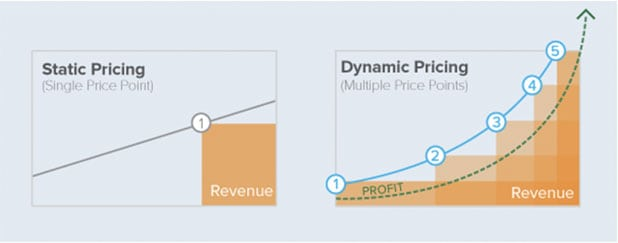
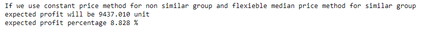

# DYNAMIC PRICING IMPLEMENTATION

A game company gave gift coins to its users for item purchases in a game. Users buy various vehicles for their characters using these virtual coins. The game company did not specify a price for an item and allowed users to buy this item at the price they wanted.

The data set includes the fees paid to the items in 6 different categories. For example, for the item named "shield", users can buy this shield by paying the amounts they see fit. In other words, a user can pay with 30 units of the virtual money, and the other user with 45 units. Therefore, users can buy this item with the amounts they are willing to pay for themselves.

As a result of the study, the price of the products, which are divided into groups that are similar and dissimilar, increased by 8.82% in the best scenario.

## *Data Set Information:*

*Private dataset*

**Variables**

- ***Category id* :** product id for each category
- **Price** : product price

